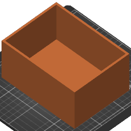

# Drawer Box

This repository contains a 3D OpenSCAD model of a box and the related slicer
GCode output and settings from PrusaSlicer tuned for my Prusa MK3S.

The naive implementation would take about 8 hours to print and would eat up 64 m
of filament. I'll experiment with bringing these numbers down. Especially the
print time.
